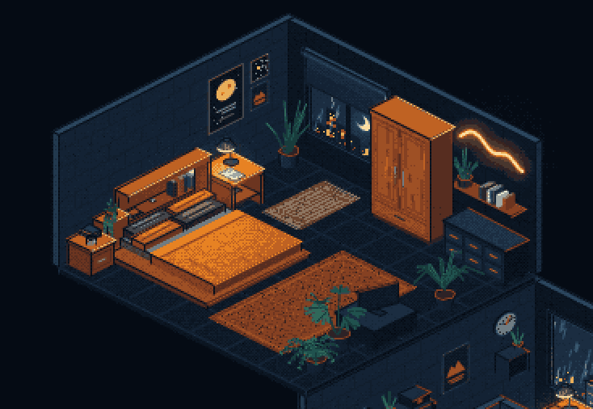

# quiet hours

Two isometric rooms, drawn pixel by pixel in a 2D canvas and snapped to thirty-two inks.
**Room one** is a small flat at night, rain on the window, lit by one desk lamp.
**Room two** is the bedroom upstairs — a bedside lamp, a neon line of hills, the moon
in a half-blinded window. It sits on room one's left wall, the way a flat upstairs would.


Open `index.html`. No build step, no dependencies, no server.

- drag to look around, scroll to zoom, `1` / `2` fly to a room, `0` comes home
- click a lamp to switch it off and on (`L`, `Enter` or `Space` do the one in view)
- that's it. The lamps are the only things in the rooms you can touch.

Each room is built from two pictures in `docs/`: `reference.png` / `reference2.jpg`
is the whole scene, `assets.png` / `assets2.png` is every piece of furniture on its own.
Each piece became one file.



---

## Layout

```
index.html              the page, and the list of scripts in load order
src/
  engine/
    core.js             the QH global, maths helpers
    palette.js          every colour the room may use — these are the inks
    inks.js             snap a frame to the palette (Bayer + static grain)
    camera.js           2:1 isometric projection, and a movable world origin
    draw.js             primitives: box, cyl, beam, disc, wall helpers …
    light.js            per-face shading from point lights, screen-space glow, one switch per lamp
  assets/               one file per thing in docs/assets.png and docs/assets2.png
  scene/
    room.js             floor slab and the two walls
    roomOne.js          where everything in room one goes, in painter order, plus its lights
    roomTwo.js          the same for room two
    house.js            both rooms in one scene: where each sits, its lamp switch, its lights
  main.js               canvas, frame loop, the camera, the lamp clicks
tools/
  preview.js            render a frame to PNG without a browser
  dev.js                tiny static server, if you want one
```

Plain `<script>` tags, one shared `QH` namespace — so the page works from `file://`
and every file can be read on its own.

---

## The assets

Every function takes a position in **world units** (room one is 14 × 14, room two
15 × 14, walls 8 high, origin at each room's far corner; +x runs along the back wall,
+y along the left wall, +z up) and an options object for size and variants. Floor
pieces take the far corner of their footprint; wall pieces take a wall (`'L'` or `'B'`)
and a position along it.

Room one:

| file | what | signature |
|---|---|---|
| `bed.js` | daybed: rail, headboard, pillow, blanket | `bed(x, y, {w, d, rail})` |
| `sofa.js` | two-seater with a throw over one arm | `sofa(x, y, {w, d, face: '-y'│'+y', seats, throw})` |
| `desk.js` | the desk body; `desk.H` is the top height | `desk(x, y, {w, d, pedestal})` |
| `deskLamp.js` | the lamp. Stores its screen geometry in `deskLamp.last` for hit-testing | `deskLamp(x, y, z, {head: [dx, dy, dz]})` |
| `chair.js` | office chair, five-star base | `chair(x, y, {face})` — (x, y) is the seat centre |
| `coffeeTable.js` | low table with a journal and a mug | `coffeeTable(x, y, {w, d, bare})` |
| `rug.js` | woven rug; `weave: true` for the plain herringbone one | `rug(x, y, w, d, {weave})` |
| `bookshelf.js` | open shelf unit, books, radio, crate, plant and box on top | `bookshelf(x, y, {w, depth, h})` |
| `hifiConsole.js` | console with records and a turntable | `hifiConsole(x, y, {w, d, bare})` |
| `speaker.js` | box speaker, any size | `speaker(x, y, z, {w, d, h, face, rim})` |
| `nightstand.js` | two drawers, a book on top | `nightstand(x, y, {face: '+x'│'+y'})` |
| `chest.js` | storage chest, books on top | `chest(x, y, {w, d, h})` |
| `snakePlant.js` | the big spiky plant | `snakePlant(x, y, z, {r, size, n})` |
| `headphones.js` | headphones on a stand | `headphones(x, y, z, {size})` |
| `monitor.js` | monitor with code on the screen | `monitor(x, y, z, t, {w, h})` |
| `keyboard.js` | keyboard, and `mouse(x, y, z)` | `keyboard(x, y, z, {w, d})` |
| `door.js` | door, frame, plate, handle, mat, hall light | `door(wall, u, {w, h, mat})` |
| `window.js` | night sky, city, rain, frame; a crescent, a lower skyline and a blind on request | `window(wall, u, z, w, h, t, {moon, skyline, blind, drops})` |
| `clock.js` | wall clock, second hand ticking | `clock(wall, u, z, r, t)` |
| `poster.js` | framed print | `poster(wall, u, z, w, h, {art: 'mountain'│'sun'│'moon'│'stars'})` |
| `stripLight.js` | bar of light on the wall | `stripLight(wall, u, z, w)` |
| `wallShelf.js` | one mounted board on brackets; put things on it at `z + wallShelf.T` | `wallShelf(wall, u, z, w, {depth})` |
| `wallCabinet.js` | small open cabinet with a radio in it | `wallCabinet(wall, u, z, w, h, {depth})` |
| `plantShelf.js` | narrow shelf with a trailing plant *(built, not placed)* | `plantShelf(x, y, {w, d, h})` |
| `filingCabinet.js` | three drawers *(built, not placed)* | `filingCabinet(x, y, {w, d, h})` |
| `lowBookcase.js` | low two-cubby unit *(built, not placed)* | `lowBookcase(x, y, {w, d, h})` |
| `props.js` | the small stuff: `mug` `penCup` `photoFrame` `notepad` `book` `bookRow` `bookStack` `openBook` `ball` `smallBox` `crate` `lidBox` `vinyl` `radio` `laptop` `journal` `turntable` `pottedPlant` `spikes` `leaves` `vines` | each `(x, y, z, o)` |

Room two:

| file | what | signature |
|---|---|---|
| `platformBed.js` | the double bed: platform, bookcase headboard with a plant on its low end, four pillows, sheet and duvet | `platformBed(x, y, {w, d, bare})` |
| `bedsideTable.js` | the two wooden tables: a cube with a drawer, books and a mug, or the open one the lamp stands on | `bedsideTable(x, y, {kind: 'drawer'│'open', w, d, h, bare})` |
| `wardrobe.js` | tall wardrobe: two panelled doors, handles, a drawer, the grain showing | `wardrobe(x, y, {w, d, h})` |
| `dresser.js` | low dark dresser, six drawers with orange handles | `dresser(x, y, {w, d, h, cols, rows})` |
| `tvStand.js` | the low stand, and `tv(x, y, z, {w, h, turn})` — the screen turned to face the bed | `tvStand(x, y, {w, d, h, bare})` |
| `neonSign.js` | a neon tube bent into hills; `neonSign.halo(k)` adds its glow in the lighting pass | `neonSign(wall, u, z, w, {h, pts})` |
| `rollerBlind.js` | roll, fabric, hem bar, cord — `window()` draws one when given `blind` | `rollerBlind(wall, u, zTop, w, drop)` |
| `runner.js` | small jute mat with fringe | `runner(x, y, w, d)` |
| `monstera.js` | split-leaf plant on tall stems | `monstera(x, y, z, {r, size, n})` |
| `fern.js` | fern, fronds arching and drooping | `fern(x, y, z, {r, size, n})` |
| `palm.js` | tall broad-leaved plant on a short trunk | `palm(x, y, z, {r, size, n})` |

The bed, lamp, posters, window, shelf, snake plants and the big rug reuse room one's files.

To change how something looks, edit its file. To move it, edit the room's file in
`scene/`. To move a whole room, edit `scene/house.js`.

---

## How it works

There is no 3D engine here, and no WebGL. It's a `2d` canvas context and four ideas.

### 1. Isometric projection

```js
sx = (x - y) * s
sy = (x + y) * s / 2 - z * s
```

A 2:1 diamond grid; `s` is pixels per unit. The camera sits at `+x +y +z`, so every
solid is drawn as three quads — the top, the `+y` face (screen-left) and the `+x` face
(screen-right). `draw.wall.L` and `draw.wall.B` wrap the two wall planes so a poster
can hang on either without knowing which axis it's on.

### 2. Painter ordering

There's no depth buffer. Things are drawn back to front in the order they appear in
each room's file: floor, rug, walls, then the wall-hung things, then furniture working
outwards from the far corner. Hand-ordering is simpler than sorting for a room this
size, and it never produces a wrong sort you have to debug. Keep the order when you
move something.

The two rooms are ordered the same way. Room two can't sit straight on top of room
one — at this camera angle its floor would hide most of the room below — so it sits on
room one's *left wall*, set back by its own width and raised by the wall's height
(`house.js` puts its origin at `(-15, 0, 8.4)`). Then its floor slab lands exactly on
the wall top and, apart from that one edge, the two rooms never overlap on screen, so
room one is simply drawn first. Each room is drawn in its own coordinates with the
world origin moved (`cam.at`), so `roomTwo.js` never has to know where it lives.

### 3. Ink quantisation

The scene paints into an offscreen buffer at a third of the display resolution, in
full colour. Then every pixel is pushed to the nearest of the thirty-two colours in
`palette.js` — a ramp of navies for the room, a ramp of oranges for whatever the lamp
touches, a few greys and greens. A 32k-entry lookup table maps 15-bit RGB to an ink,
so the pass is one table read per pixel.

Before the lookup each pixel gets a light Bayer nudge (so the lamp's falloff breaks
into rings instead of bands) and a static hash grain (so flat navy fills speckle the
way the reference does). Pixel art wants hard edges, so every `box()` also strokes a
one-pixel contour round its silhouette, and can take a warm `rim` along the top edges
that face the light.

### 4. Light

Two layers. First, **per-face shading**: `light.shade()` gives each face a brightness
from its base factor plus every point light's `n · L`, falling off with distance. Each
room registers its own sources (the desk lamp and the strip light downstairs; the
bedside lamp, the neon and a little moonlight upstairs), so the bed rail's inner face
is lit while the desk pedestal's far end isn't — and when the lamp goes off, every
face falls back to its base. Second, **materials**: surfaces the lamp
recolours (the desk top, the rug, the blanket) pick their colour with
`light.warm(dark, lit)`. Last, a few small **glows** are composited in screen space
with `'lighter'` — the bulb, a pool on the desk, the strip, the monitor, the hall
light under the door. They're small on purpose; the reference recolours surfaces
rather than blooming.

Each lamp is a `switch` in `light.js`, a 0..1 that eases toward its target; before a
room is painted, `house.js` makes its switch the current `light.lamp`, which is what
`warm()` reads. So switching a lamp off is still one number changing, and the rooms
can be lit independently.


---

## tools/preview.js

Renders a frame to PNG without a browser, so you can iterate on an asset fast.
It reads the `<script src>` list from `index.html`, runs those files in order against
a minimal DOM backed by [node-canvas](https://github.com/Automattic/node-canvas), and
writes the frame at 2× nearest-neighbour.

```bash
npm install
node tools/preview.js out.png [seconds] [width] [height] [lamp] [zoom] [panX] [panY] [room]

npm run preview            # docs/preview.png
npm run preview:dark       # docs/lights-out.png — every lamp off
node tools/preview.js two.png 4.2 1100 760 1 1 0 0 two      # framed on room two
node tools/preview.js look.png 4.2 1100 760 1 2.4 -120 90   # zoomed in on the desk
```

The tool is for development only — `index.html` has no dependency on it and ships alone.

---

## Adding a room

1. Write the assets it needs as files in `src/assets/`, one per thing, using
   `QH.draw` primitives and `QH.M` colours. Keep new colours in the palette or they'll
   snap to a neighbour.
2. Write `src/scene/roomThree.js` after the pattern of `roomTwo.js`: build a
   `QH.scenes.room(w, d, h)`, place things in painter order, list its light sources,
   keep the lamp's geometry for the click.
3. Add it to `rooms` in `scene/house.js` with an origin that keeps it clear of the
   others on screen, and add the scripts to `index.html`.

---

## Credit

Made after seeing [a small light, room by room](https://a-small-light-three.vercel.app/),
which does the same trick in daylight on cream paper. The technique is borrowed;
the room, the palette and the code are not.
