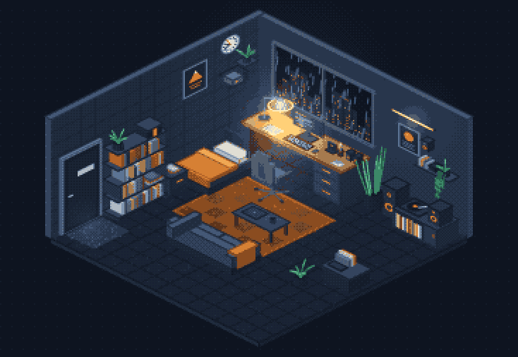
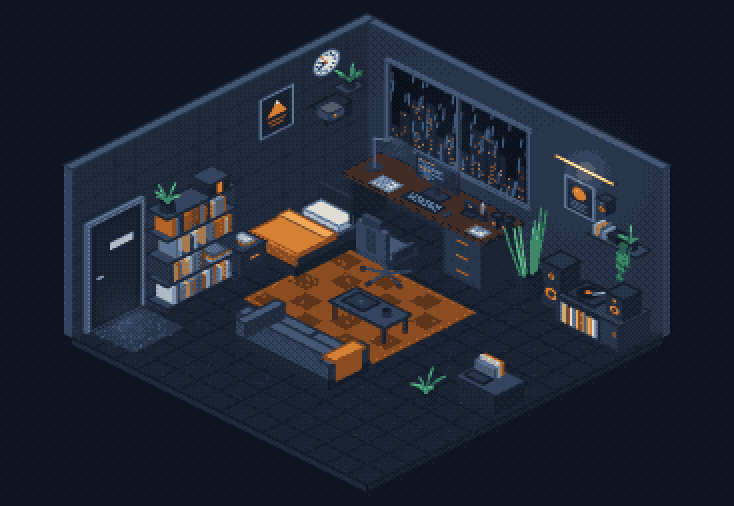

# quiet hours

An isometric room, drawn pixel by pixel in a 2D canvas and snapped to thirty-one inks.
The first room is **room one** — a small flat at night, rain on the window, lit by one desk lamp.



Open `index.html`. No build step, no dependencies, no server.

- click the lamp to switch it off and on (`L`, `Enter` or `Space` also work)
- that's it. The lamp is the only thing in the room you can touch.

---

## How it works

There is no 3D engine here, and no WebGL. It's a `2d` canvas context and four ideas.

### 1. Isometric projection

The whole illusion of depth is three lines:

```js
sx = (x - y) * tileW
sy = (x + y) * tileH - z * tileZ
```

A 2:1 diamond grid. Increasing `x` moves right-and-down, increasing `y` moves
left-and-down, `z` moves straight up. The camera sits at `+x +y +z`, so every solid
in the room is drawn as three quads — the top, the `+y` face (screen-left) and the
`+x` face (screen-right) — because those are the only three faces whose normals point
at the camera. Getting this wrong draws the *back* faces instead, and every box in
the room quietly turns inside out. That was the first room's problem.

### 2. Painter ordering

There's no depth buffer. Things are drawn back to front, in the order they appear
in `frame()`: floor, rug, walls, then furniture working outwards from the far corner.
Because the room is authored by hand rather than generated, hand-ordering is simpler
and more controllable than sorting — and it never produces a wrong sort you have to
debug.

### 3. Ink quantisation

The scene paints into an offscreen buffer at a third of the display resolution, in
full colour. Then every pixel is pushed to the nearest of thirty-one inks — a run of
navies for the room, a run of oranges for everything the lamp touches, three greens
for the plants, a few for the window. A 32k-entry lookup table maps 15-bit RGB to an
ink index, so the whole pass is one table read per pixel.

An 8×8 Bayer matrix nudges each pixel first, but only by ±4. That's deliberate:
flat surfaces stay flat, and only the smooth things — lamp falloff, the strip light's
halo — break into stepped rings of ink. The first room dithered everything at ±27 and
looked like a photocopy. Pixel art wants clean fills and hard edges, so every `box()`
also strokes a one-pixel dark contour round its top and down its front corner.

### 4. Light in screen space

Lighting isn't per-face. After the scene is painted, radial gradients are composited
over it with `globalCompositeOperation = 'lighter'`, then the quantiser runs. The lamp
is four of these: a hot core at the bulb, a pool on the desk, a wash up the wall and a
wide warm ambient that reaches the chair. The strip light, the monitor, the city
through the glass and the hall light under the door are the same trick at lower
strength.

`LAMP` is a 0..1 that eases toward whatever the switch says. The lamp's glows are
multiplied by it, and the desk top lerps from dull dark wood to lit wood with it, so
switching the lamp off is one number changing.

---

## The primitives

Everything in the room is built from these:

| | |
|---|---|
| `poly(pts, fill)` | a flat polygon in world space |
| `box(x,y,z, w,d,h, col)` | axis-aligned solid: `+y` face, `+x` face, top, contour |
| `rectX / rectY` | a rectangle flat against the left or back wall |
| `cyl(cx,cy,z, r,h, col)` | cylinder or cone, camera-facing segments only |
| `shade(...)` | a cone wider at the bottom — every segment drawn, back to front |
| `disc / discX / discY` | a circle on the horizontal, `x=` or `y=` plane |
| `beam(a, b, w, col)` | a thick line — lamp arm, cables, clock hands, leaves |
| `fern(...)` | a fan of leaves; every small plant in the room is one of these |
| `speckle(...)` | scattered flecks — floor grain, the door mat |

Widths and radii are all in **world units**, not pixels. `beam()` multiplies by
`BASE.tw * cam.z` to get there.

---

## The lamp

The lamp is the one interactive thing, and it's found by hit-testing in screen space:
`overLamp()` projects the shade and the stem with `P()` and checks the pointer
against a circle round the head and a capsule down the stem. The cursor changes when
you're over it; a click flips `lampTarget`, and `LAMP` eases after it.



---

## Adding a second room

The room is just a set of functions called in order from `frame()`. To add another:

1. Write your `function myRoom(t)` alongside `desk()`, `bookshelf()` and the rest.
2. Call it from `frame()` in back-to-front order.
3. Keep new colours inside the value structure, or they'll disappear:
   floor and walls sit low (inks 1–3), furniture in the middle (4–6),
   highlights at 7–10, the lamp's things at 11–17. Two objects at the same value
   quantise to the same ink and merge into each other, however different
   their hues look in the source.

---

## tools/preview.js

Renders a frame to PNG without a browser, so you can iterate on the visuals fast.
It pulls the `<script>` straight out of `index.html` and runs it against a minimal
DOM backed by [node-canvas](https://github.com/Automattic/node-canvas).

```bash
npm install
node tools/preview.js out.png [seconds] [width] [height] [lamp] [zoom] [panX] [panY]

node tools/preview.js look.png 4.2 1100 760 1 2.4 -120 90   # zoomed on the desk
node tools/preview.js dark.png 4.2 1100 760 0               # lamp off
```

The tool is for development only — `index.html` has no dependency on it and
ships alone.

---

## Working from a reference

Describing a picture to an AI and asking it to draw the room gets the layout
roughly right and everything measurable wrong: the palette drifts, the light
becomes a halo, the pixel size wanders. So the measuring is done by two Python
scripts, and the AI is only asked to compose.

```bash
pip install -r tools/requirements.txt

npm run analyze        # docs/reference.png → docs/analysis/reference.spec.json + pngs
npm run compare        # render the room, score it against the reference
```

**`tools/analyze.py`** reads any pixel-art isometric image and writes a spec:

| it measures | how | what it's for |
|---|---|---|
| pixel scale | period of the edge-energy profile | render buffer size, `native.png` |
| palette | k-means in Lab, merged, grouped by hue, sorted by value | paste into `INK[]` — same shape |
| projection | slope of the floor silhouette; seam period on bare floor pixels | `BASE.tw / th`, room size in tiles |
| lights | blurred-luminance peaks, falloff radius, distinct levels along a ray | where light is, and whether it's a halo or recoloured surfaces |
| floor / walls | inks, mean L, tile & brick period, dither fraction | texture, `spread` |
| objects | distance from the local median background → boxes, floor or wall position in world units | the object list; labels are null until you fill them from `annotated.png` |

**`tools/compare.py`** brings a render and the reference to the same native
resolution, crops both to the room silhouette, quantises the render to the
reference palette, and reports per-cell luminance, warmth, edge density and
ink count, plus which inks the render never uses, an SSIM and a 0–100
headline. `--diff` writes a side-by-side with a luminance heatmap. The number
is only for telling whether an edit helped; read the worst cells for what to
change.

The loop is: analyze once → hand the spec and annotated PNG to the AI → it
writes the room → `npm run compare` → fix the worst cells → repeat. Object
segmentation is the one stage that is heuristic; everything else is a
measurement.

---

## Credit

Made after seeing [a small light, room by room](https://a-small-light-three.vercel.app/),
which does the same trick in daylight on cream paper. The technique is borrowed;
the room, the palette and the code are not.
